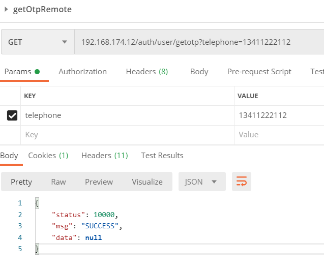
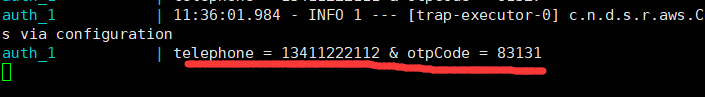

## 分布式简易秒杀系统

​         java个人练习项目，仅后端部分，参考[miaosha_Shop](https://github.com/MaJesTySA/miaosha_Shop)完成，接口略有变化，目前使用SpringCloud Netflix版，暂没有使用配置中心，Alibaba版在学（后期提供）。目前仅支持个人注册及jwt网关认证，查询商品及发布秒杀下单操作。

​        后期会逐步完善各种功能。

---

[TOC]

#### 主要技术栈：

1. SpringBoot (SSM框架)
2. SpringCloud（目前使用Netflix版，注册中心Eureka, 网关Zuul( 集成 客户端负载均衡 Ribbon ，断路器Hystrix）
3. Mysql
4. Redis
5. RocketMQ
6. SpringCloud Oauth2(包含Spring Security)
7. OpenResty（集成Nginx 反向代理）

#### 部署

需要三台虚拟机，因为是本机调试，所以可以关掉CentOS的防火墙：


1. 中间件（2核4G ）

   ​        已使用Docker-compose进行了集成，MySQL，Redis，RocketMQ，OpenResty）将DockerMiddleware文件夹移入虚拟机中，在**docker-compose.yml**所在目录下运行`docker-compose up -d`命令构建容器镜像并运行即可。

   ​        相关配置（如mysql端口、用户、初始密码等）见docker-compose.yml文件。相关中间件的配置见对应的conf目录。mysql文件夹里的init.sql中有本项目用到的数据库。nginx反向代理负载均衡在nginx.conf中修改。

   **目录结构如下：**

   ```bash
   Docker
   ├── docker-compose.yml
   ├── mysql
   │   └── init.sql
   ├── nginx
   │   ├── conf
   │   ├── logs
   │   ├── site
   │   └── vhost
   ├── redis
   │   └── conf
   └── rmq
       ├── broker
       │   ├── conf
       │   ├── logs
       │   └── store
       └── srv
           ├── logs
           └── store
   
   ```

2. **app1** （2核4G）

   项目克隆后先clean，然后rebuild，compile，package打包.jar文件后，**按如下目录结构进行部署：**

   ```bash
   Cloud-seckill/
   ├── auth
   │   ├── cloud-seckill-auth-0.0.1-SNAPSHOT.jar
   │   └── Dockerfile
   ├── docker-compose.yml
   ├── eureka-server
   │   ├── cloud-seckill-eureka-server-1.0-SNAPSHOT.jar
   │   └── Dockerfile
   ├── item
   │   ├── cloud-seckill-item-0.0.1-SNAPSHOT.jar
   │   └── Dockerfile
   ├── order
   │   ├── cloud-seckill-order-0.0.1-SNAPSHOT.jar
   │   └── Dockerfile
   └── zuul
       ├── cloud-seckill-zuul-0.0.1-SNAPSHOT.jar
       └── Dockerfile
   
   ```

   在Cloud-seckill目录下（**docker-compose.yml**所在目录），运行`docker-compose up -d` 进行构建容器运行。

   

3.  **app2 **（2核4G，可由app1克隆后修改对应的静态IP即可）

   

#### Swagger文档

打开浏览器输入swagger-ui地址，查看接口

```html
192.168.174.12/swagger-ui.html
```

192.168.174.12是中间件主机（Nginx）的地址


#### Postman接口测试：

前端未完成，暂使用Postman进行测试：

1. 获取短信验证码用来注册，（短信接口未完成，需终端查看验证码）

   

2. 终端查看验证码(短信，邮箱接口未实现，可以使用消息队列实现)

   

3. 利用该短信验证码注册用户信息，并注册，手机号验证码虚一致

   

4. 根据商品Id查看商品详情，查看商品不需要登录认证。

   

   

5. 下单前需要登录，网关会拦截。获取改用户的JWT，本项目使用JWT认证。

   Authorization里填写jwt发放者信息(照填即可)

   

   Body里填写用户信息

   

6. 秒杀前确保商品库存大于零，否则下单失败。

   

7. 发布秒杀活动，不发布则按原价扣费（Header里需填写Authorization Bear 你的JWT令牌【见步骤7】，目前还未进行RBAC角色控制，即通过认证均可以发布秒杀活动）

   

8. 秒杀前先获取，防刷验证码

   

9. 下单前先获取秒杀令牌（令牌大闸，按秒杀商品数量的5倍发放）（需由前端将此步骤与步骤10写进一个按钮）

   

   令牌获取失败（数额不够，验证码错误等情况）

   

10. 填写秒杀Token，下单（对于前端和步骤9在一个按钮里完成）

    

    下单失败情况（没有库存，秒杀Token不对或未获取等情况）。

    

11. 下单后可以去数据库看订单库存等变化，或实现根据用户ID获取订单的接口（未完成）。。。

    

#### 压测

1. 商品详情接口优化前

   

2. 商品详情接口优化后

   

3. 下单接口优化前

   

4. 下单接口优化后

   

   成功下单结果：

   

   下单失败效果：

   

#### Reference:

* [miaosha_Shop](https://github.com/MaJesTySA/miaosha_Shop)

